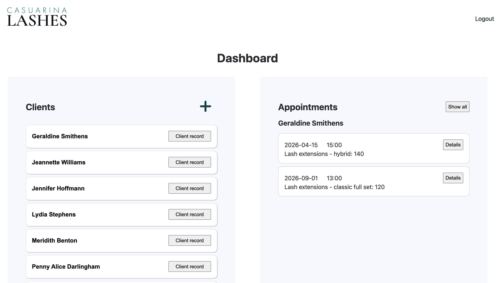
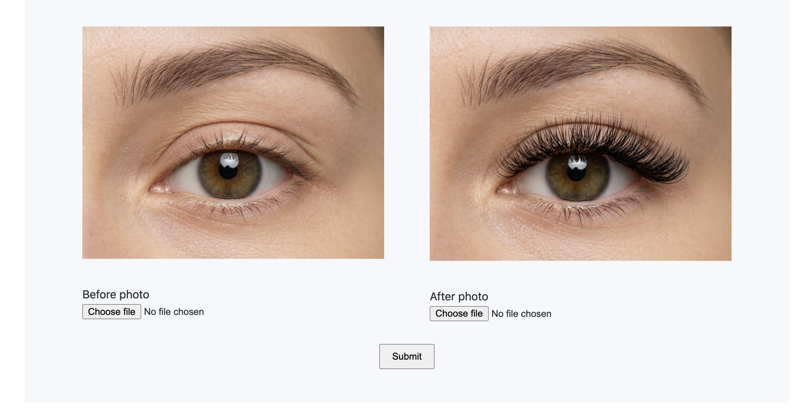

# Eyelash extensions client management dashboard

I offer eyelash services as a side business and have made this app to help manage appointments and client records with before and after photos.  
This was a huge learning experience for me and I made some unforgivable security mistakes in the beginning; therefore I have hidden the original repo!  
I will be removing some of the reqested information fields after learning cybersecurity concepts about private and personal information. While traditionally beauty forms have included lots of client information it is not strictly necessary and poses increased risk.

## Purpose of this project was to learn

**PHP** - coding standards, prepared statements, working with session variables.\
**SQL** - query the database safely.\
**Basic login & authentication**

## Purpose of the app

**Login** - password authentication to access app and view data.\
**Dashboard** - see all clients, appointments per client, all appointments for all clients.\
**Client Records** - view, create, update, delete client details.\
**Client Appointments** - view, create, update, delete appointment records including historical records. \
**Image uploads** - before and after images of each service per appointment.

## TO DO

- Create image upload logic within update appointment functionality.
- Style the app.
- Remove form fields collecting unnecessary information.

## Video (needs to be updated)

**Video** https://www.youtube.com/watch?v=TUVhsts9-S8

## Images

  
**Image upload**

